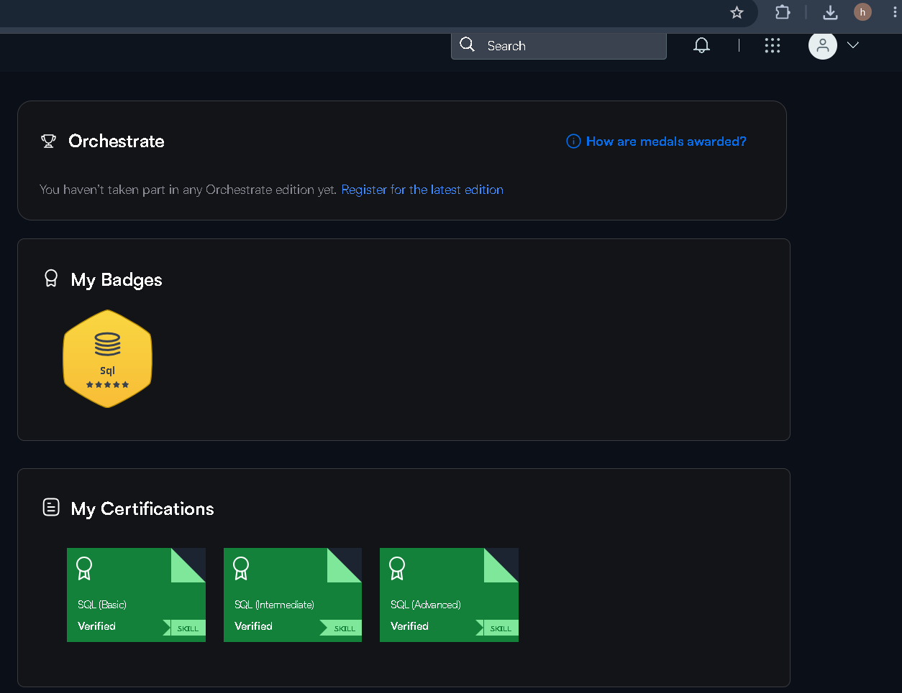

# Hi there 👋 I'm Harshita Mahajan

🎓 B.Tech Computer Science & Engineering student at Guru Nanak Dev University  
📊 Aspiring Data Analyst | Business Intelligence Analyst  
💡 Interested in SQL, Python, Power BI, Excel and Data Analytics

---

## 🛠️ Skills

**Languages & Databases:**  
Python, SQL, MySQL, C, C++

**Data Analysis:**  
Pandas, NumPy, Data Cleaning, EDA, Advanced Excel

**BI & Visualization:**  
Power BI, DAX, Tableau, Matplotlib, Seaborn, Plotly

**Tools:**  
Git, GitHub

---

## 📊 Featured Projects

### 🛒 Enterprise E-Commerce Business Intelligence Solution

End-to-end Business Intelligence project covering data cleaning, EDA, SQL analysis and Power BI dashboard development.

**Technologies:** Python, Pandas, NumPy, MySQL, Power BI, DAX, Excel

🔗 [View Project](https://github.com/harshita-mahajan-02/enterprise-ecommerce-business-intelligence)

---

### 🚗 Road Accident Analytics Dashboard

Interactive Excel dashboard analyzing 307K+ accident records and casualty patterns across road and environmental conditions.

**Technologies:** Microsoft Excel, PivotTables, PivotCharts, SUMIFS, COUNTIFS

🔗 [View Project](https://github.com/harshita-mahajan-02/road-accident-analytics-project-excel)

---

### 🕵️ Crime Incident Data Analysis

SQL-based data cleaning and analysis project using joins, aggregations, CTEs and window functions.

**Technologies:** MySQL, SQL

🔗 [View Project](https://github.com/harshita-mahajan-02/crimes-analytics-sql)

---

### 🏏 IPL Analysis Dashboard

Interactive Tableau dashboard analyzing team and player performance across IPL seasons.

**Technologies:** Tableau, Data Visualization

🔗 [View Project](https://github.com/harshita-mahajan-02/ipl-analysis-tableau)

---

## 🏆 Certifications & Achievements

### HackerRank SQL

Successfully completed and verified all three HackerRank SQL certifications:

- ✅ SQL (Basic) — Verified
- ✅ SQL (Intermediate) — Verified
- ✅ SQL (Advanced) — Verified
- ⭐ 5-Star SQL Badge

🔗 [View my HackerRank Profile](https://www.hackerrank.com/harshitamahajan8)

---

## 💼 Experience

**Data Analyst Intern — CACMS**  
Jun 2026 – Sep 2026

- Guided 10+ students in Excel, SQL and Python.
- Supported dashboard development and dataset selection.
- Delivered C programming training sessions.

---

## 📫 Connect With Me

🔗 [LinkedIn](https://www.linkedin.com/in/harshita--mahajan)

💻 [GitHub](https://github.com/harshita-mahajan-02)

📧 btech.harshitamahajan@gmail.com
